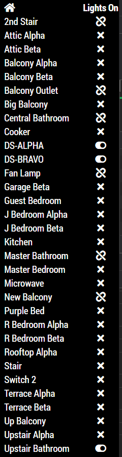
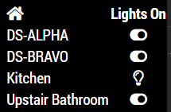
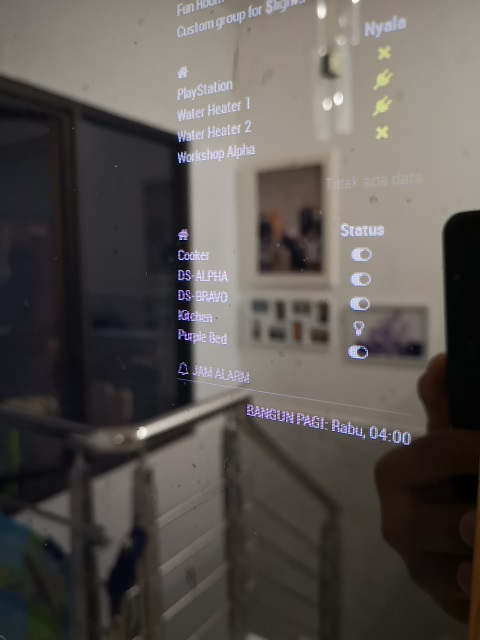

# MMM-TuyaSL []

Tuya-based-devices Smarthome Module for MagicMirror<sup>2</sup>. By default, this module is implemented for devices managed by [SmartLife](https://play.google.com/store/apps/details?id=com.tuya.smartlife) (android) application.

## Example

      

## Dependencies

* An installation of [MagicMirror<sup>2</sup>](https://github.com/MichMich/MagicMirror)

## Installation

1. Clone this repo into `~/MagicMirror/modules` directory.
   `cd ~/MagicMirror/modules`
   `git clone https://github.com/slametps/MMM-TuyaSL.git`
2. Go to `~/MagicMirror/modules/MMM-TuyaSL` directory and do `npm install`
   `cd ~/MagicMirror/modules/MMM-TuyaSL`
   `npm install`
3. Configure your `~/MagicMirror/config/config.js`:

    ```
    {
        module: 'MMM-TuyaSL',
        position: 'top_right',
        header: 'TuyaSL',
        config: {
	  userName: 'your_smartlife_username',
	  password: 'your_smartlife_password',
	  countryCode: 'ID',
	  showOnlyOnline: true,
	  showOnlyOn: false,
	  colour: false,
	  updateInterval: 300 * 1000,
	  timeout: 10 * 1000,
        }
    }
    ```

## Config Options

| **Option** | **Default** | **Description** |
| --- | --- | --- |
| `userName` | (mandatory) | your tuya-smartlife account username |
| `password` | (mandatory) | your tuya-smartlife account password |
| `countryCode` | `ID` | Your country code, e.g. ID, US, EU, etc |
| `bizType` | `smart_life` | default bizType for SmartLife app user. Use `tuya` for Tuya app user. |
| `from` | `tuya` | please leave unchanged |
| `colour` | `false` | displaying power status in colour or not |
| `updateInterval` | `300000 ms` (5 minutes) | how often should the devices states refreshed (minimal is 5 minutes => Tuya policy) |
| `showOnlyOnline` | `false` | if set to true the module shows only the devices which are online |
| `showOnlyOn` | `false` | if set to true the module shows only the devices which are on |
| `showLabel` | `true` | show header label? |
| `timeout` | `3000` | how long the discovery should be taken |
| `animationSpeed` | `2500 ms` (2.5 s) | Speed of the update animation |


[](https://forthebadge.com)
[](https://forthebadge.com)
